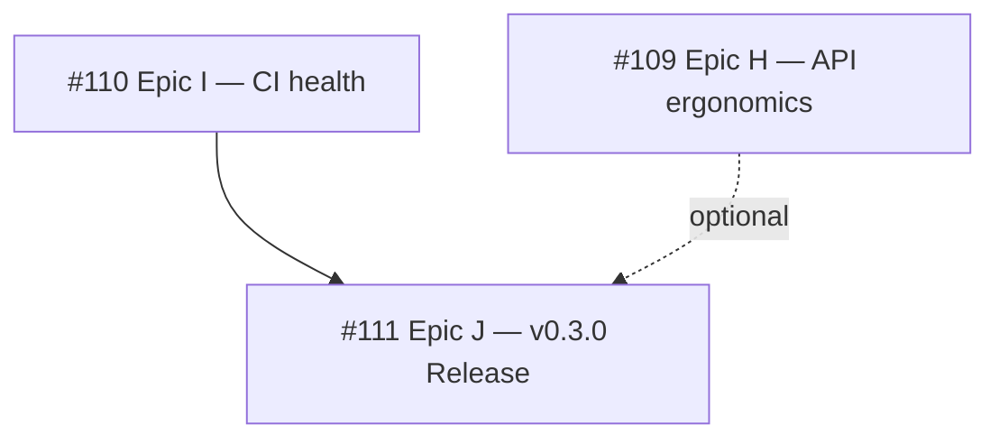

# Roadmap — zippeR

## Now (in progress)

_No epics in progress._

## Next (planned)

- **[Epic I] CI & Development Infrastructure Health** (#110) — Correct the CI caching layer (key collisions, unsound restore, frozen `tigris` cache); 0/1 sub-issues closed
- **[Epic H] User-Facing API Ergonomics & Dependency Reduction** (#109) — Self-contained `zi_`-prefixed API surface plus Phase 3 dependency decisions; 0/3 sub-issues closed
- **[Epic J] v0.3.0 Release** (#111) — Ship 2024 ZCTA support to CRAN; sub-issues to be filed at kickoff

## Later (aspirational)

- **Deprecated argument removal** (#71) — Remove `input_zip` and `dict` from `zi_crosswalk()`; time-gated to early 2027

## Recently Shipped

- **[Epic E] Code & Test Quality Audit** (#48) — closed 2026-08-06
- **[Epic G] CRAN Release Preparation** (#79) — closed 2026-06-02
- **[Epic F] New Features & Enhancements** (#49) — closed 2026-06-01
- **[Epic C] Documentation Improvements** (#24) — closed 2026-05-29
- **[Epic B] Code Style & Error Handling** (#23) — closed 2026-05-28
- **[Epic D] Package Infrastructure & CRAN Readiness** (#25) — closed 2026-05-28
- **[Epic A] Test Coverage & Quality** (#22) — closed 2026-05-28

## Epic dependencies

- [Epic I] should land before [Epic J] so release checks run against a trustworthy pipeline.
- [Epic H] is optional for the release; #108 (`zi_census_api_key()`) is a good candidate to include if it lands in time.
